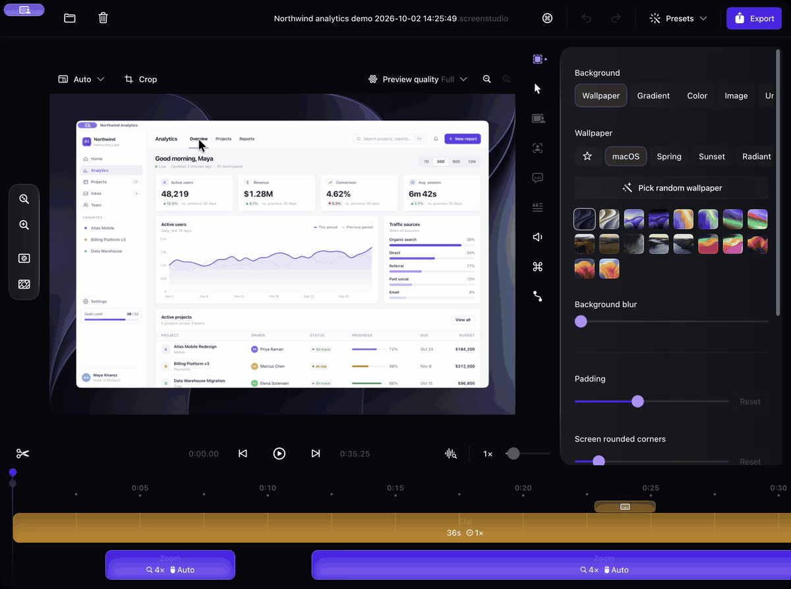

# Screen Studio MCP

<p align="center">
  
  <br>
  <sub><b>Real-time editing.</b> It'll get things done in less than 20 seconds.</sub>
</p>

<p align="center">Record and edit Screen Studio videos from Claude Code, Codex or any MCP client.</p>

<p align="center">
  <a href="https://www.npmjs.com/package/screenstudio-mcp"></a>
  <a href="LICENSE"></a>
  
</p>

Screen Studio MCP does two jobs:

- **Record a video for you.** It operates your app with real clicks, typing and scrolling while [Screen Studio](https://screen.studio) records.
- **Edit a video already in Screen Studio.** Each change plays out live in the open editor, where you can watch it and undo it.

You direct every edit in your own words. Presets are optional starting points.

## Get started

```bash
npx screenstudio-mcp
```

This installs the server and the record, edit and deliver skills into Claude Code and Codex, then checks your Mac. Restart your agent and ask for a video.

Or install it as a plugin.

Claude Code:

```text
/plugin marketplace add tolimarchuk/screenstudio-mcp
/plugin install screenstudio@screenstudio-mcp
```

Codex:

```bash
codex plugin marketplace add tolimarchuk/screenstudio-mcp
codex plugin add screenstudio@screenstudio-mcp
```

## Record a video

Describe what to show. The agent picks the window, display or area, starts Screen Studio and uses the app while it records. Give it a script and it paces the recording to the narration.

```text
Record a 30-second demo of signing up and creating the first project in my app. Make it fast and punchy for X, with captions.
Record the settings flow at a calm tutorial pace, no music, and narrate each step from this script.
```

## Edit a video you already have

Open a project in Screen Studio and say what you want, in any style. The agent reads the footage, plans the edit and applies it in the editor while you watch.

```text
Cut the dead air, speed up the slow parts and zoom in on every click. Dark gradient background, 9:16 for Shorts.
Trim this to 45 seconds, blur any emails or API keys, add calm background music and export for LinkedIn and the docs.
```

## What it can do

1. **Record any Mac app.** Starts Screen Studio on a window, a display or an area, then operates the app with real clicks, typing, drags, scrolls and shortcuts while it records.
2. **Record to a script's timing.** Voices the script first, holds each recorded beat for as long as its line runs and drops a marker where each beat starts.
3. **Edit live in Screen Studio.** Cuts, splits, speed changes, zooms, layouts and masks play out step by step in the open editor, and Cmd+Z undoes any of them.
4. **Plan the edit from the footage.** Reads clicks, typing, idle time and speech, proposes cuts, speed-ups and grouped zooms, trims pauses and filler words, and can fit the edit to a target length.
5. **Change any Screen Studio setting.** Sets any of the project's 111 settings, including background, cursor, captions, camera, device frame, shadow, motion blur and aspect ratio.
6. **Add narration, music and captions.** Adds neural voice lines pinned to moments in the video, mixes them over music from Screen Studio's library that ducks under speech, and captions them.
7. **Switch camera layouts for talking heads.** Plans camera cutout, full-screen and split-screen layouts from speech and clicks, and switches between them only at sentence breaks.
8. **Blur private data automatically.** Finds emails, API keys, tokens, card numbers and passwords with on-device text recognition, follows each one across frames and masks it with blur.
9. **Export every format at once.** Renders one edit as X, LinkedIn, Shorts, portrait, landing-page and docs versions plus a GIF, each with its own aspect ratio, padding, caption size and zoom.
10. **Apply presets and brand kits.** An optional preset sets pacing, look, aspect, captions, cursor, music, voice and export as a starting point. A saved brand kit applies your colors, caption font, cursor, voice and music to any project.

In all: 46 tools, 20 edit operations and all 111 Screen Studio settings, with 148 device frames, 182 wallpapers, 24 cursor sets and 17 music tracks to choose from. See [docs/coverage.md](docs/coverage.md).

## Presets (optional)

Every edit is custom. A preset is an optional starting point: name one in your request, then change anything about it in your own words.

| Preset | Use it for |
|---|---|
| `keynote` | A product moment for a big screen or launch page: slow pacing, dark background, a few shallow zooms. |
| `social-vertical` | A 9:16 clip for a vertical feed: under 30 seconds, big cursor, line-by-line captions. |
| `changelog` | One shipped feature in under 45 seconds: quiet frame, no captions, one or two zooms on what changed. |
| `founder-talking-head` | Someone on camera talking through their product: cutout camera, pauses and fillers trimmed, never sped up. |
| `tutorial` | Teaching a task step by step: calm holds, shortcuts on screen, a chapter per marker, a friendly narrator. |
| `launch-teaser` | A 20-second teaser before a launch: only the best beats, payoff last, bright gradient, upbeat music. |
| `docs-walkthrough` | A silent clip for documentation: plain light frame, typing slow enough to copy, every shortcut shown. |

## Compatibility

Supported: Screen Studio up to 4.0.1 (build 4897), the tested build, on macOS. Reading projects and footage works on any 4.x build. Recording and editing on any other build, older or newer, needs `SCREENSTUDIO_ALLOW_UNTESTED=1`. Turn off Screen Studio's auto-update to stay on the tested build. See [docs/compatibility.md](docs/compatibility.md).

## Requirements

- macOS with [Screen Studio](https://screen.studio) 4. Recording and editing need 4.0.1; see [Compatibility](#compatibility).
- Node.js 22 or newer.
- `ffmpeg` and `ffprobe`: `brew install ffmpeg`.
- Optional, for narration: `edge-tts` (`pipx install edge-tts`). Narration text is sent to Microsoft's online speech service.
- Accessibility and Screen Recording permission for the app your agent runs in (Terminal, Claude, Codex).

`npx screenstudio-mcp doctor` checks all of it.

## Commands

```bash
npx screenstudio-mcp                  # install into Claude Code (and Codex if present), then check this Mac
npx screenstudio-mcp doctor           # check Screen Studio, ffmpeg and permissions
npx screenstudio-mcp@latest update    # move to the newest version
npx screenstudio-mcp uninstall        # remove the server and skills
```

<details>
<summary>Manual setup and configuration</summary>

Claude Code:

```bash
claude mcp add -s user screenstudio -- npx -y screenstudio-mcp serve
```

Codex, in `~/.codex/config.toml`:

```toml
[mcp_servers.screenstudio]
command = "npx"
args = ["-y", "screenstudio-mcp", "serve"]
tool_timeout_sec = 1800
```

| Variable | What it does |
|---|---|
| `SCREENSTUDIO_APP_PATH` | Path to Screen Studio, if it is not in Applications. |
| `SCREENSTUDIO_PORT` | A fixed automation port (1024 to 65535) instead of a free one. |
| `SCREENSTUDIO_STATE_DIR` | Where checkpoints, caches and brand kits live. Default `~/.screenstudio-mcp`. |
| `SCREENSTUDIO_ALLOW_UNTESTED` | `1` allows recording and editing on a Screen Studio 4.x build other than 4.0.1 (build 4897), older or newer. |
| `SCREENSTUDIO_ALLOW_APPS` | Comma-separated bundle ids of extra apps the agent may click and type in. Terminals, password managers and System Settings are skipped unless listed here. |
| `SCREENSTUDIO_FFMPEG`, `SCREENSTUDIO_FFPROBE`, `SCREENSTUDIO_EDGE_TTS` | Paths to those tools, if they are not found automatically. |

</details>

## Development

```bash
npm ci
npm run check
```

See [CONTRIBUTING.md](CONTRIBUTING.md), [docs/architecture.md](docs/architecture.md), [docs/compatibility.md](docs/compatibility.md) and the [changelog](CHANGELOG.md).

## Also by Toli

<table>
  <tr>
    <td width="45%">
      <a href="https://github.com/tolimarchuk/goalbuddy"></a>
    </td>
    <td>
      <a href="https://github.com/tolimarchuk/goalbuddy"><b>GoalBuddy</b></a><br>
      A better <code>/goal</code> for Codex and Claude Code: a finish line, a live board and proof for long agent runs.<br><br>
      <a href="https://github.com/tolimarchuk/goalbuddy"></a>
      <code>npx goalbuddy</code>
    </td>
  </tr>
</table>

## License

MIT. See [LICENSE](LICENSE). Not affiliated with Screen Studio.

---

<p align="center">
  Built by <a href="https://x.com/tolibear_">Toli Marchuk</a> at <a href="https://heysigna.com">heysigna.com</a>.<br>
  Want something like this built for your team? <a href="https://heysigna.com">Work with me at Signa</a>.<br><br>
  <a href="https://x.com/tolibear_"></a>
</p>
